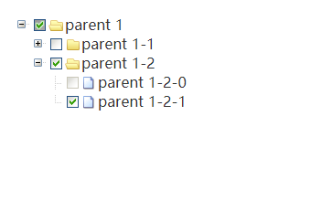

# 简介

本教程为 [react-component](https://github.com/react-component/) 中 [Tree](https://github.com/react-component/tree) 源码分析，记录 React 学习过程。

分为两部分：

- Tree 组件实现

- React 知识须知

对 React 不熟悉的同学可以快速过下第二部分 **React 知识须知** ，该部分主要会讲到开发 React Tree 组件过程中涉及的 React 知识点。

## Tree 组件实现

常见具备树结构的 UI 展示，如文件管理：



具备树形结构的 UI，可以通过 `Tree 组件` 完整展现其中的层级关系，并且可额外增加**展开**、**收起**、**选择** 等交互功能。

本教程主要讲解 **展开** 功能，其余功能触类旁通。

下面开始讲解 Tree 组件实现过程，主要分为三部分：

- 组件设计

### 组件设计

实现具备展开功能的树组件应该可以接受如下属性：

- `treeData` 数据源
- `autoExpandParent` 是否自动展开父级
- `defaultExpandAll` 是否展开所有层级
- `defaultExpandParent` 是否默认展开父级
- `defaultExpandedKeys` 默认展开的层级

对应树组件属性接口设计如下：

```jsx
<Tree
  treeData={treeData}
  autoExpandParent
  defaultExpandAll
  defaultExpandParent
  defaultExpandedKeys={['0-0']}
/>
```

#### treeData

出于 React 中 `key` 可用于 `diff` 渲染优化这一考虑，可将 `key` 作为树组件每个节点的唯一标识。因此，作为树组件的数据源 `treeData` 一般可具备如下结构：

```js
const treeData = [
  {
    key: '0-0',
    title: 'parent 1',
    children: [
      {
        key: '0-0-0',
        title: 'parent 1-1',
        children: [{ key: '0-0-0-0', title: 'parent 1-1-0' }]
      },
      {
        key: '0-0-1',
        title: 'parent 1-2',
        children: [
          { key: '0-0-1-0', title: 'parent 1-2-0' },
          { key: '0-0-1-1', title: 'parent 1-2-1' }
        ]
      }
    ]
  }
];
```

为减少理解难度，本教程会严格按照按如上数据结构去实现一个树组件。

#### HTML 结构

接着看视图的 HTML 结构：

```html
<ul class="rc-tree">
  <li>
    <span class="rc-tree-switcher"></span><span>父节点</span>
    <ul class="rc-child-tree">
      <li><span class="rc-tree-switcher"></span><span>子节点</span></li>
    </ul>
  </li>
</ul>
```

这里可以引入一个 `TreeNode` 组件负责 HTML 渲染部分，而 `Tree` 组件主要负责处理数据及状态传递，整体树组件初步代码实现如下：

```jsx
class Tree extends React.Component {
  render() {
    return <ul>// TreeNode</ul>;
  }
}

class TreeNode extends React.Component {
  render() {
    return (
      <li>
        <span>父节点</span>
        <ul>
          <li>
            <span>子节点</span>
          </li>
        </ul>
      </li>
    );
  }
}

const tree = (
  <Tree>
    <TreeNode />
  </Tree>
);
```

### 数据处理

React 一个很大的作用就是 **数据驱动视图**，接下来，我们需要把数据跟视图结合起来。

`Tree` 组件接收一个 `treeData` 属性，现在的任务是把 `treeData` 跟视图绑定起来。

首先，我们会在 `Tree` 组件里处理接收过来的 `treeData` ，这里会用到 React 静态方法 `getDerivedStateFromProps`，作用是每次接收新的 `props` 之后都会返回一个对象作为新的 `state`。

```js
class Tree extends React.Component {
  state = {
    treeNode: [],
    expandedKeys: []
  };
  static getDerivedStateFromProps(props, prevState) {
    const { treeData } = props;
    const newState = {
      prevProps: props,
      treeNode: convertDataToTree(treeData)
    };
    // ...
    return newState;
  }
  render() {
    // 用 getDerivedStateFromProps 将 props 中获取的 treeData 赋值给 state
    // 这里获取的 treeNode 是经过 convertDataToTree 方法处理过后的节点树。
    const { treeNode } = this.state;
    return (
      <ul className="rc-tree">
        {treeNode.map(child => {
          // 这里 renderTreeNode 方法用于处理
          return this.renderTreeNode(child);
        })}
      </ul>
    );
  }
}
```

`convertDataToTree` 方法的作用是将 `treeData` 转换为 `TreeNode` 组件嵌套结构。

```js
const convertDataToTree = treeData => {
  if (!treeData) return [];
  const list = Array.isArray(treeData) ? treeData : [treeData];
  return list.map(({ children, ...props }) => {
    const childrenNodes = convertDataToTree(children);
    return <TreeNode {...props}>{childrenNodes}</TreeNode>;
  });
};

// 比如传入之前提到的 treeData 后，会得到如下结构：

<TreeNode key="0-0" title="parent 1">
  <TreeNode key="0-0-0" title="parent 1-1">
    <TreeNode key="0-0-0-0" title="parent 1-1-0" />
  </TreeNode>
  <TreeNode key="0-0-1" title="parent 1-2">
    <TreeNode key="0-0-0-0" title="parent 1-2-0" />
    <TreeNode key="0-0-0-0" title="parent 1-2-1" />
  </TreeNode>
</TreeNode>;
```

至此，数据与结构就绑定在了一起。下面来看下与展开功能相关的 `TreeNode` 组件实现

### TreeNode 实现

理论上 `TreeNode` 组件只需要接受三个属性：

- `key` 组件唯一标识
- `expanded` 是否展开的标识
- `children` 这里指子元素

UI 展示需要包括：

```js
class TreeNode extends React.Component {
  render() {
    const { title, children } = this.props;
    return (
      <li>
        {this.renderSwitcher()} // 展开元素
        {title} // 父节点内容
        {this.renderChildren(children)} // 子节点
      </li>
    );
  }
}
```

树组件的展开功能包括：

- 点击开关，控制层级展开关系
- 设置默认展开
- 设置是否全部展开

这里 `renderSwitcher` 方法用来控制节点层级关系，`onExpand` 是节点点击的事件处理程序，代码如下：

```js
class TreeNode extends React.Component {
  onExpand = e => {
    const { onNodeExpand } = this.context;
    onNodeExpand(e, this);
  };
  renderSwitcher = () => {
    const { expanded, children } = this.props;

    if (children.length === 0) {
      return <span className="rc-tree-switcher rc-tree-switcher-noop" />;
    }

    const switcherCls = classNames(
      `rc-tree-switcher`,
      `rc-tree-switcher_${expanded ? 'open' : 'close'}`
    );
    return <span onClick={this.onExpand} className={switcherCls} />;
  };
}
```

大致的逻辑是，点击展开节点(这里指 `<span></span>` 标签)，通过 `this.context` 调用 `父组件` (Tree 组件) 的 `onNodeExpand`。

之前说过，`TreeNode` 组件负责渲染，而对数据的维护都提升到了 `Tree` 组件。

这里运用比较多的是 `context`，不了解的同学可以看第二部分 `React 知识须知` 中的 `context`

### expandedKeys 状态维护

树子节点的展开状态统一由 `expandedKeys` 维护，`expandedKeys` 数组中的 `key` 表示对应展开的节点的 `key`。

- `defaultExpandAll` 为 `true`，表示 `expandedKeys` 数组包含所有 `key`
- `autoExpandParent` 或 `defaultExpandParent` 为 `true` 意味着会自动将展开节点的父节点的 `key` push 到 `expandedKeys`
- `defaultExpandedKeys` 可以设置默认展开的节点。

另外，当用户点击子组件的展开控制按钮时，会调用父组件的 `onNodeExpand` 方法：

```js
class Tree extends React.Component {
  onNodeExpand = (e, treeNode) => {
    let { expandedKeys } = this.state;
    const { expanded, eventKey } = treeNode.props;
    const targetExpanded = !expanded;

    if (targetExpanded) {
      expandedKeys = arrAdd(expandedKeys, eventKey);
    } else {
      expandedKeys = arrDel(expandedKeys, eventKey);
    }
    this.setUncontrolledState({ expandedKeys });
  };

  setUncontrolledState = state => {
    let needSync = false;
    const newState = {};

    Object.keys(state).forEach(name => {
      if (name in this.props) return;

      needSync = true;
      newState[name] = state[name];
    });

    if (needSync) {
      this.setState(newState);
    }
  };
}
```

最终通过 `this.setState(newState);` 方法触发子组件重新渲染。

至此一个完整的展开状态控制就完成了，对于一些数据的转换，如查找展开节点的父节点的 `key` 值，可直接看源码。

## React 知识须知

### babel 相关

```json
{
  "plugins": [
    "@babel/plugin-proposal-class-properties",
    "@babel/plugin-transform-react-jsx"
  ]
}
```

使用 jsx 语法需要 `@babel/plugin-transform-react-jsx` babel 插件的支持，另外如果需要用到如下定义[PropTypes](https://react.docschina.org/docs/typechecking-with-proptypes.html)的语法：

```js
class Tree extends React.Component {
  static propTypes = {
    autoExpandParent: PropTypes.bool,
    defaultExpandAll: PropTypes.bool,
    defaultExpandParent: PropTypes.bool,
    defaultExpandedKeys: PropTypes.arrayOf(PropTypes.string)
  };
}
```

需要添加 `@babel/plugin-proposal-class-properties` 插件。

### context 的使用

1. 父组件产生 `Context`，

- 父组件需要声明 `childContextTypes` 静态属性供子组件的 `Context` 对象属性使用;

- 实现一个 `getChildContext` 方法，并返回一个代表 `Context` 的纯对象。

```js
import React from 'react';
import PropTypes from 'prop-types';

class MiddleComponent extends React.Component {
  render() {
    return <ChildComponent />;
  }
}

class ParentComponent extends React.Component {
  // 声明Context对象属性
  static childContextTypes = {
    propA: PropTypes.string,
    methodA: PropTypes.func
  };

  // 返回 Context 对象，方法名是约定好的
  getChildContext() {
    return {
      propA: 'propA',
      methodA: () => 'methodA'
    };
  }

  render() {
    return <MiddleComponent />;
  }
}
```

2. 子组件使用 `Context`

- 子组件需要声明 `contextTypes` 后才能使用父组件 `Context` 对象;

```js
import React from 'react'
import PropTypes from 'prop-types'

class ChildComponent extends React.Component {
  // 声明需要使用的Context属性
  static contextTypes = {
    propA: PropTypes.string
  }

  render () {
    const {
      propA,
      methodA
    } = this.context

    console.log(`context.propA = ${propA}`)  // context.propA = propA
    console.log(`context.methodA = ${methodA}`)  // context.methodA = undefined

    return ...
  }
}
```

3. 无状态组件使用 `Context`

```js
import React from 'react'
import PropTypes from 'prop-types'

const ChildComponent = (props, context) => {
  // 函数第二个参数作为 context
  const {
    propA
  } = context

  console.log(`context.propA = ${propA}`)  // context.propA = propA

  return ...
}

ChildComponent.contextProps = {
  propA: PropTypes.string
}
```

4. 新版本使用 `Context`

[官方文档](https://reactjs.org/docs/context.html#reactcreatecontext)

通过 `React.createContext()` 静态方法创建一个 `context` 对象，这个 `Context` 对象包含两个组件

- `<Provider />`

- `<Consumer />`

```js
import React from 'react';
import ReactDOM from 'react-dom';

const ThemeContext = React.createContext({
  background: 'red',
  color: 'white'
});

class App extends React.Component {
  render() {
    return (
      <ThemeContext.Provider value={{ background: 'green', color: 'white' }}>
        <Header />
      </ThemeContext.Provider>
    );
  }
}
```

其中 `<Provider />` 的 `value` 相当于之前使用的 `getChildContext()`。

```js
class Header extends React.Component {
  render() {
    return <Title>Hello React Context API</Title>;
  }
}

class Title extends React.Component {
  render() {
    return (
      <ThemeContext.Consumer>
        {context => (
          <h1 style={{ background: context.background, color: context.color }}>
            {this.props.children}
          </h1>
        )}
      </ThemeContext.Consumer>
    );
  }
}
```

**注意：** `<Consumer />` 的 `children` 必须是一个函数，函数的第一个参数是 `Context`

### getDerivedStateFromProps

每次接收新的 `props` 之后都会返回一个对象作为新的 `state`，返回 `null` 则说明不需要更新 `state`。

### cloneElement

```js
React.cloneElement(element, [props], [...children]);
```

> 以 element 作为起点，克隆并返回一个新的 React 元素(React Element)。生成的元素将会拥有原始元素 props 与新 props 的浅合并。新的子级会替换现有的子级。来自原始元素的 key 和 ref 将会保留。

React.cloneElement() 几乎相当于：

```js
<element.type {...element.props} {...props}>
  {children}
</element.type>
```

### `React.Children`

[官方文档](https://react.docschina.org/docs/react-api.html#react.children)

`React.Children` 提供了处理 `this.props.children` 这个不透明数据结构的工具。
